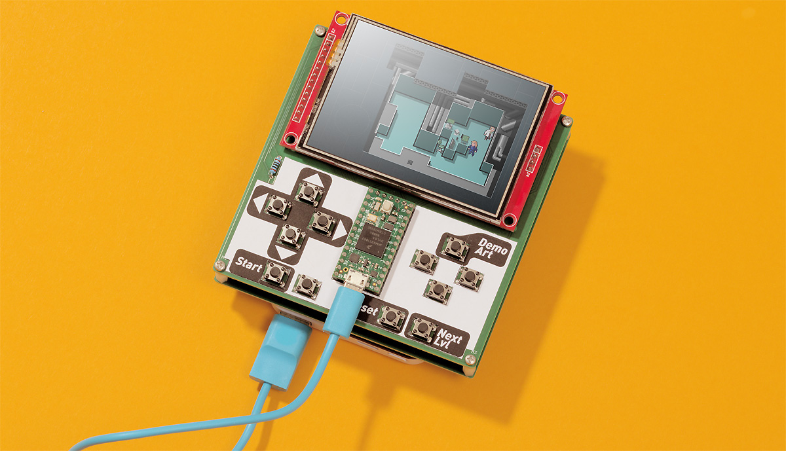

# Handheld game console and Arduino game

The motivation and goal of this project was primarily as an excuse to try and design my first PCB. Choosing a handheld game console made an appealing form on several points:

- Has enough wiring to be an interesting, but achievable with no prior experience
- Makes a useful progression from a breadboard prototype
- Results in an artifact that has broad appeal and is fun showing off to tech, and non-tech, friends alike  

To fully realise success I needed a game to run on the hardware. To Achieve this requirement I chose to appropriate the key game mechanic of Sokoban (designed in 1981 by Hiroyuki Imabayashi, and first published in December 1982 [[wikipedia](https://en.wikipedia.org/wiki/Sokoban)]).

## Hardware

Having a [Teensy 4](https://www.pjrc.com/store/teensy40.html) and [TFT screen](https://www.pjrc.com/store/display_ili9341_touch.html) on hand set some initial design constraints. The microcontroller has generous limitations and made for fast firmware development without the need for much attention to optimisation.

The initial wiring was tested on a bread-board with microcontroller and screen communicating via SPI. Several input buttons were multiplexed, not due to lack of gpio pins, but simply to try out a technique new to me. At this point the hardware worked reliably but was somewhat unwieldy to press buttons and move around my desk whilst developing the game. 

The screen module includes touch input and an SD card reader. In the spirit of making a fully-featured development device I decided to enable these additional components. Once connected on the bread-board the hardware ceased to work reliably. Testing individually each did work correctly making for a hopeful outlook. I decided to forge ahead and include these components after ponder failure/fix scenarios:

- Bread-board/wiring issue - Issue will be fixed with PCB wiring
- Faulty hardware - I can cut traces on the PCB effectively 'removing' components
- Firmware error - Not initialising components or changing code/libraries should resolve errors

With a somewhat working bread-board prototype I moved onto designing a PCB with [KiCad](https://www.kicad.org/). Component placement was dictated largely by functional requirements of being a hand-held game console. Routing wires became a puzzle that included reconfiguring pin functions of the microcontroller for most efficient outcomes. Amongst advice I gained during this process was to print out and place parts before finalising the design which proved to be golden as I picked up a measurement error in a footprint I created. I also created some simple graphics for the silkscreen to test that process.

Prior to commencing the PCB design I selected [PCBWay](https://www.pcbway.com/) for fabrication. My choice was primarily driven by price and website usability/clarity. Opting for the cheapest configuration (I had no real confidence this project would work out) guided maximum PCB size and some other KiCad settings to meet fabrication requirements. On completion of the design, submission of files was straight forward with good documentation on the PCBWay website to guide the process. Fabrication and delivery was _fast_, 5 day turn-a-round with the vast majority of that time being transit to/through Australia. The novelty of holding my own, high quality and professionally manufactured, PCB is still exciting a few weeks later as I write-up this project summary. The PCB looks excellent including the silkscreen test graphics which is encouraging to try out some more demanding artwork for the next project.

Assembly on the PCB was uncomplicated with only through hole components and all parts fitting as intended. Once assembled SPI reliability issues vanished with all components working perfectly. I assume controlling x3 SPI devices was pushing the capabilities of my bread-board. Power and portability was resolved by taping a small battery bank to the reverse side and providing power via the USB plug. This made for a fun prototype to show off on-the-go and easy to swap for tethered development at my desk.

## Firmware

Goals for this section of the project were less defined than the hardware - Something fun to show off and achievable to create. I have a 'secret' ongoing project of creating a roguelike and would very much like it to run on a handheld console. With several attempts of this game genre for desktop under my belt - all of them failures of varying degrees - I decided to set some further constraints around what a 'minimum viable product' might look like. The result is my homage to Sokoban (see intro for details). The code is total overkill for the task at hand but with the thought it might be the groundwork for a more complex roguelike game.

The project utilises the Arduino environment which streamlines access to libraries, interfacing with hardware, and compiling/uploading. Whilst Arduino is essentially C++, I've attempted to primarily write in C compatible code as practice for developing for more restricted hardware devices. 

In the course of processing graphics for embedding into the game I wrote a hand-full of Python scripts. These are a work-in-progress as I experiment and streamline how I create graphical assets (sprites, level maps, and background tiles) and process them for embedding into the code.

At the time of writing this the game is fully functional with 3 levels. The user interface includes buttons to reset, skip levels, plus display a demo art screen. The latter as a talking point for where the graphics may go when showing off the project.
